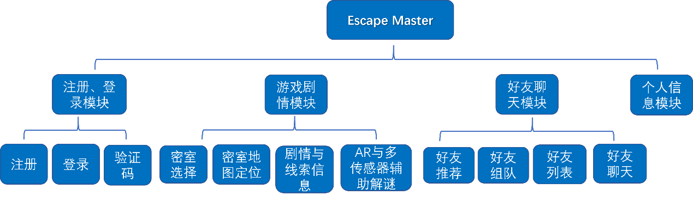
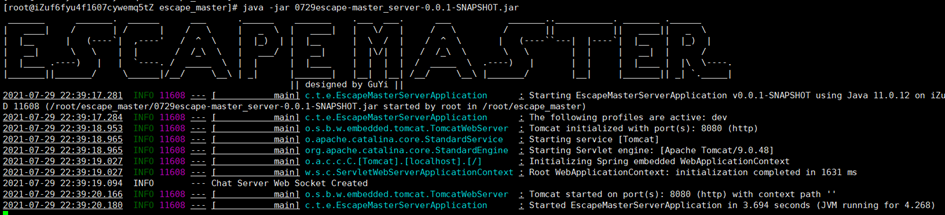
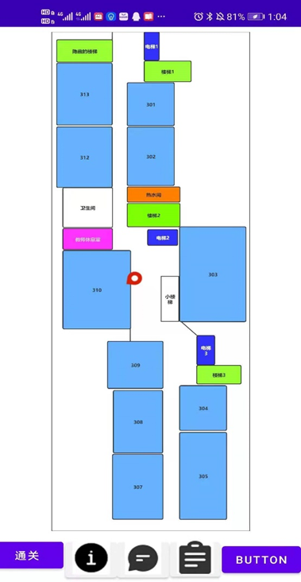

# Escape Master

## Introduction

Design and implementation of positioning tool based on WiFi signal strength

## Software architecture diagram

### Overall architecture

### Back end architecture

## Functional structure design drawing

## Screenshot

### Software design specification

[software design specification](assets/项目设计说明书.pdf)

## Installation tutorial

1. configuration environment

2. adjust the positioning algorithm parameters according to the location

3. operation

## Participation contribution

1. fork this repository

2. create feat_XXX branch

3. submission code

4. create a new pull request