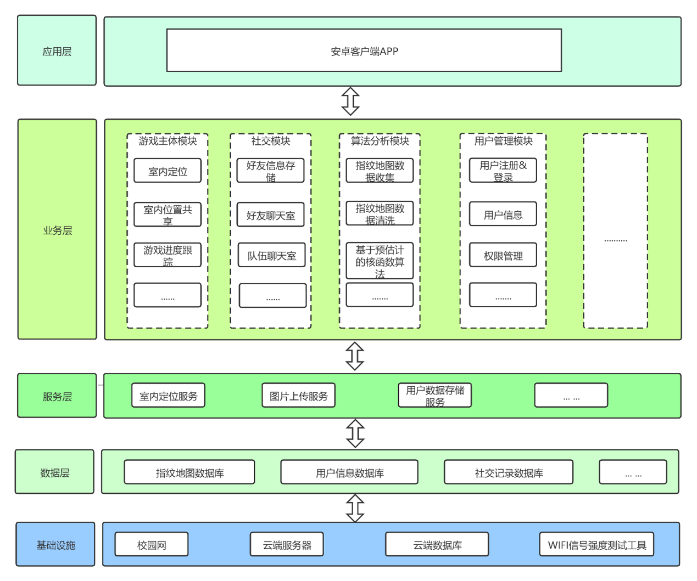
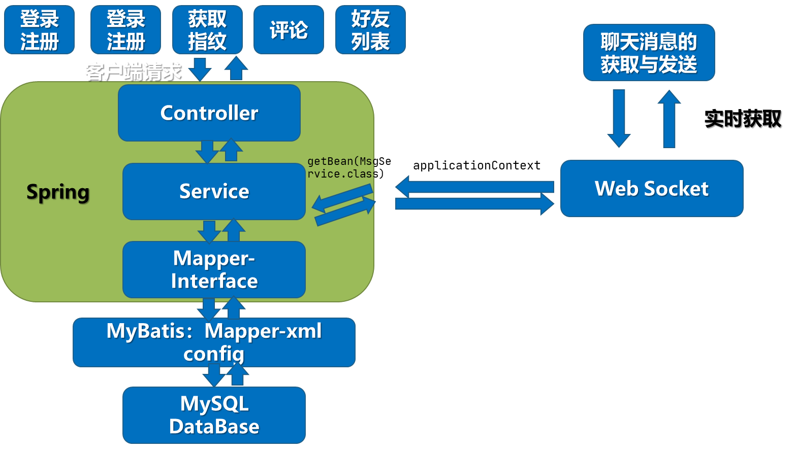
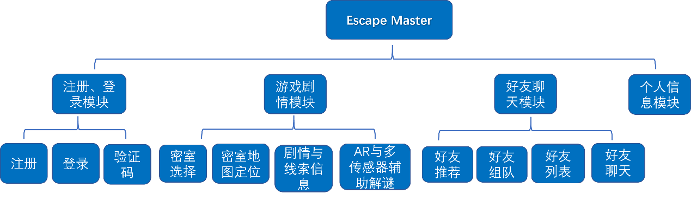
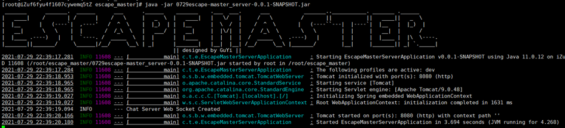
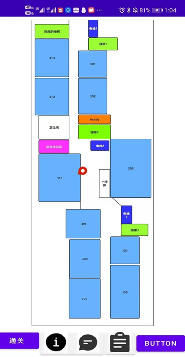

# Escape Master

## 介绍
基于WIFI信号强度的定位工具的设计与实现

## 软件架构图
### 总体架构

### 后端架构

## 功能结构设计图

## 屏幕快照

### 软件设计说明书
[软件设计说明书](assets/项目设计说明书.pdf)

## 安装教程

1.  配置环境
2.  根据所处位置调整定位算法参数
3.  运行

## 参与贡献

1.  Fork 本仓库
2.  新建 Feat_xxx 分支
3.  提交代码
4.  新建 Pull Request

